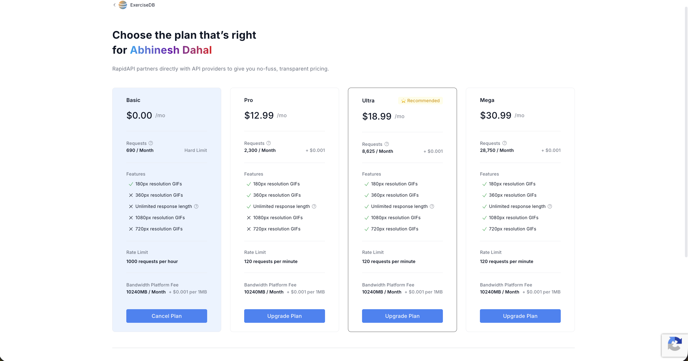

# Exercise API Migration: ASCENDAPI → ExerciseDB
SCRUM-92 | Find New Exercise API and update Credentials

---

## What's happening?

We're replacing the exercise data API that powers the app's exercise library. Right now, the app pulls exercise data (names, muscle groups, equipment, images) from an API called **ASCENDAPI** through RapidAPI. We're switching it to a different API on the same platform called **ExerciseDB**.

The app itself doesn't change for the user — they still browse exercises, pick muscle groups, and see exercise demos. What changes is where that data comes from behind the scenes.

| | Current (ASCENDAPI) | New (ExerciseDB) |
|---|---|---|
| **RapidAPI Host** | `edb-with-videos-and-images-by-ascendapi.p.rapidapi.com` | `exercisedb.p.rapidapi.com` |
| **Base URL** | `https://edb-with-videos-and-images-by-ascendapi.p.rapidapi.com/api/v1` | `https://exercisedb.p.rapidapi.com` |
| **API Key env var** | `XRAPID_API_KEY` | `XRAPID_API_KEY` (same variable, same RapidAPI key system) |

---

## Why are we switching?

### 1. The current API returns data in unpredictable formats

When we ask ASCENDAPI for a list of exercises, the response can be wrapped in any of 5 different keys — `data`, `exercises`, `items`, `results`, or `body` — depending on which endpoint we hit. Sometimes the exercises are nested two levels deep. We wrote a function called `_extract_list()` in `exercise_client.py` specifically to handle this, and it checks all 5 possible shapes every single time. That shouldn't be necessary.

### 2. The current API can't find common exercises

ASCENDAPI fails to return results for basic exercises like "bench press" or "pull ups" often enough that the team had to hardcode 9 common exercises directly into the source code as a fallback (the `LOCAL_EXERCISE_FALLBACKS` dictionary in `exercise_service.py`). When the API can't find an exercise, the app falls back to this hardcoded list so users don't see an empty screen. That's a workaround, not a solution.

### 3. There's no way to filter exercises on the server

When a user selects a muscle group like "chest" in the app, the backend has to fetch 50 exercises from ASCENDAPI and then loop through them in Python to manually keep only the ones that match "chest." That wastes bandwidth and processing time. ExerciseDB has a dedicated endpoint (`/exercises/bodyPart/chest`) that returns only chest exercises — no local filtering needed.

### 4. Field names change between responses

The same piece of data comes back under different names depending on the endpoint. For example, an exercise's image might be in a field called `gifUrl`, `imageUrl`, or `imageUrls.480p`. The target muscle might be under `target`, `targetMuscles` (an array), or `bodyParts` (also an array). Both the backend (`normalize_exercise_payload` in `exercise_service.py`) and the frontend (`normalizeExercise` in `exerciseUtils.js`) have multi-branch if/else chains to handle all the possible field names. With ExerciseDB, every exercise always uses the same field names — so all of that normalization code goes away.

### 5. ExerciseDB has animated GIFs for every exercise

Every exercise in ExerciseDB comes with an animated GIF showing how to perform the movement. ASCENDAPI has image support too, but as mentioned above, the field name changes between responses and sometimes it's missing entirely. ExerciseDB guarantees a `gifUrl` field on every single exercise. This directly improves the user experience — every exercise will have a visual demo.

---

## What does ExerciseDB actually return?

This is what a single exercise looks like from ExerciseDB:

```json
{
  "id": "0001",
  "name": "3/4 sit-up",
  "bodyPart": "waist",
  "target": "abs",
  "equipment": "body weight",
  "gifUrl": "https://v2.exercisedb.io/image/...",
  "secondaryMuscles": ["hip flexors", "lower back"],
  "instructions": ["Lie flat on your back...", "Bend your knees...", "Curl your upper body..."]
}
```

Every field is always present. Every field is always the same name. Compare that to ASCENDAPI where:
- `target` might be `target`, `targetMuscles[0]`, or `bodyParts[0]`
- `equipment` might be `equipment` or `equipments[0]`
- the image might be `gifUrl`, `imageUrl`, `imageUrls.480p`, or `imageUrls.360p`
- `instructions` might be `instructions`, `steps`, or `guide`

ExerciseDB's consistency is the single biggest reason for this switch.

---

## Pricing

ExerciseDB has a free tier, but it's limited to **690 requests per month (hard limit)**. With everyone testing and the app making API calls on every page load, that will run out quickly.

The paid tiers are:
- **Pro** — $12.99/mo, 2,300 req/month
- **Ultra** — $18.99/mo, 8,625 req/month (this is what we will be negotiating with prof for)

We need to **talk to the professor about getting a paid subscription** before the demo. 



---

## What changes in the code?

Here's a summary of every decision that affects the codebase, and why.

| Decision | What it means |
|---|---|
| Delete `_extract_list()` | ExerciseDB always returns a plain JSON array — we don't need to guess which wrapper key the exercises are inside |
| Use ExerciseDB's endpoints directly | Instead of one generic `/exercises` endpoint, we now use `/exercises/bodyPart/{bp}` for filtering, `/exercises/exercise/{id}` for single lookups, and `/exercises/name/{name}` for search |
| Delete `LOCAL_EXERCISE_FALLBACKS` | ExerciseDB reliably returns all 1,300+ exercises — no need for hardcoded backup data |
| Simplify `resolve_exercise()` | The current 4-step fallback chain (try ID → try name → try aliases from fallback dict → return hardcoded data) becomes 2 steps: try ID, then try name |
| Fix `BICEPS`/`TRICEPS` routing | ExerciseDB groups both under `upper arms` as a body part, so both would return the same list. Instead, we route those two through `/exercises/target/biceps` and `/exercises/target/triceps` to get distinct results |
| Update `BODY_PART_MAP` for LEGS | ASCENDAPI used `thighs`, ExerciseDB uses `upper legs` |
| Join `instructions` into a string | ExerciseDB returns instructions as an array of strings (one per step) — we join them into a single string before displaying |
| Cache API responses in PostgreSQL | Exercise data doesn't change — once we fetch an exercise, we should store it in the database so future requests don't hit the API again. This is critical with the rate limit |
| Handle 429 rate limit errors | When the monthly limit is hit, the API returns HTTP 429. The current error handling would show this as a generic 502 "bad gateway" error, which is confusing. We need to catch 429 specifically and show a meaningful message |

---

## Implementation steps

### Step 1 — Get the ExerciseDB API key

1. Go to RapidAPI and search for **ExerciseDB** (by Justin, rated 9.9 — the first result).
2. Subscribe to the free tier (or paid if the professor approves).
3. Copy your API key from the RapidAPI dashboard.
4. Paste it into `main_application/app/backend/.env` as `XRAPID_API_KEY`.

---

### Step 2 — Update `exercise_client.py`

**File:** `main_application/app/backend/services/exercise_client.py`

This is the file that talks directly to the API. All the URL and request changes happen here.

- Change `BASE_URL` to `https://exercisedb.p.rapidapi.com`
- Change `HOST` to `exercisedb.p.rapidapi.com`
- Delete the `_extract_list()` method entirely — it's no longer needed
- Update `get_exercises()`:
  - For BICEPS/TRICEPS: hit `/exercises/target/{target}` to get distinct results
  - For all other body parts: hit `/exercises/bodyPart/{body_part}`
  - If no body part specified: hit `/exercises`
  - Return `response.json()` directly — no wrapping or unwrapping
- Update `get_exercise_by_id()`: change URL to `/exercises/exercise/{id}`
- Update `find_exercise_by_name()`: change URL to `/exercises/name/{name}`, return the exact match or the first result

---

### Step 3 — Update `exercise_service.py`

**File:** `main_application/app/backend/services/exercise_service.py`

This is the file that normalizes API responses and handles fallback logic.

- Delete the entire `LOCAL_EXERCISE_FALLBACKS` dictionary
- Simplify `normalize_exercise_payload()` — ExerciseDB fields are consistent, so just read `data.get("target")`, `data.get("equipment")`, `data.get("gifUrl")` directly. Join the `instructions` array into a single string with `" ".join()`
- Simplify `resolve_exercise()` — try by ID first, then by name. Return `{"error": "Exercise not found"}` if neither works
- Add rate limit handling — check if the API response status is `429` and return `{"error": "rate_limit"}` so the route layer can handle it differently from other errors
- Add response caching — before calling the API, check if the exercise already exists in the database. If it does, return the cached version without making an API call

---

### Step 4 — Update `exerciseUtils.js`

**File:** `main_application/app/frontend/vite-project/src/utils/exerciseUtils.js`

This is the frontend utility that maps UI labels to API values and normalizes exercise data for display.

- Update `BODY_PART_MAP`:
  - `LEGS` → `'upper legs'` (was `'thighs'`)
  - `BICEPS` → `'biceps'` (was `'biceps'` but now routes to `/target/` endpoint)
  - `TRICEPS` → `'triceps'` (was `'triceps'` but now routes to `/target/` endpoint)
- Simplify `normalizeExercise()` — use `exercise.id`, `exercise.target`, `exercise.equipment`, `exercise.gifUrl` directly. Handle `instructions` as an array: `Array.isArray(instructions) ? instructions.join(' ') : instructions`

---

### Step 5 — Update `exerciseUtils.test.js`

**File:** `main_application/tests/react/utils/exerciseUtils.test.js`

The existing test suite has **9 tests that will fail** after the changes above because they test the old multi-branch normalization behavior. These tests need to be rewritten to match ExerciseDB's flat schema:

- `maps LEGS to thighs` → update expected value to `'upper legs'`
- `uses exerciseId when available` → update to use `id` (ExerciseDB doesn't have `exerciseId`)
- `uses targetMuscles[0] for muscle_group` → update to use `target` directly
- `falls back to bodyParts[0] for muscle_group` → remove (no longer applicable)
- `uses equipments[0] for equipment` → update to use `equipment` directly
- `uses instructions for description` → update expected value to a joined string, not an array
- `falls back to steps for description` → remove (ExerciseDB doesn't use `steps`)
- `uses imageUrl for image_url` → update to use `gifUrl`
- `falls back to image_url field directly` → remove (only `gifUrl` exists now)

---

### Step 6 — Test everything

**Manual API tests:**
1. `GET /exercises?bodyPart=chest` — should return exercises with images
2. `GET /exercises/0001` — should return a single exercise with `gifUrl`, `instructions`, and `equipment`
3. `GET /exercises?bodyPart=biceps` and `?bodyPart=triceps` — should return **different** exercise lists
4. Trigger a 429 (or mock one) — should return a clear rate limit error, not a generic 502

**UI test:**
5. Open the exercise browser, select each muscle group, verify exercises load with animated GIFs

---

## Files changed

| File | What changes |
|---|---|
| `services/exercise_client.py` | New base URL, new endpoint paths, remove `_extract_list` |
| `services/exercise_service.py` | Remove fallback dict, simplify normalization, add caching + 429 handling |
| `api/routes/exercises.py` | Handle 429 → 503 error case |
| `utils/exerciseUtils.js` | Update `BODY_PART_MAP`, simplify `normalizeExercise` |
| `tests/react/utils/exerciseUtils.test.js` | Update 9 failing tests for ExerciseDB schema |
| `backend/.env` | Update `XRAPID_API_KEY` value |
| `core/config.py` | No change |
