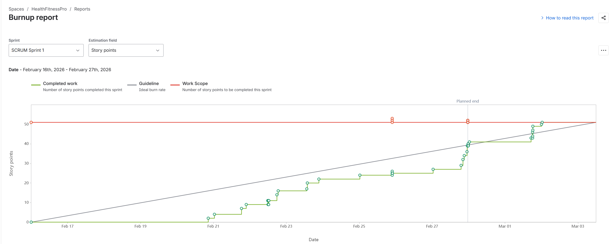
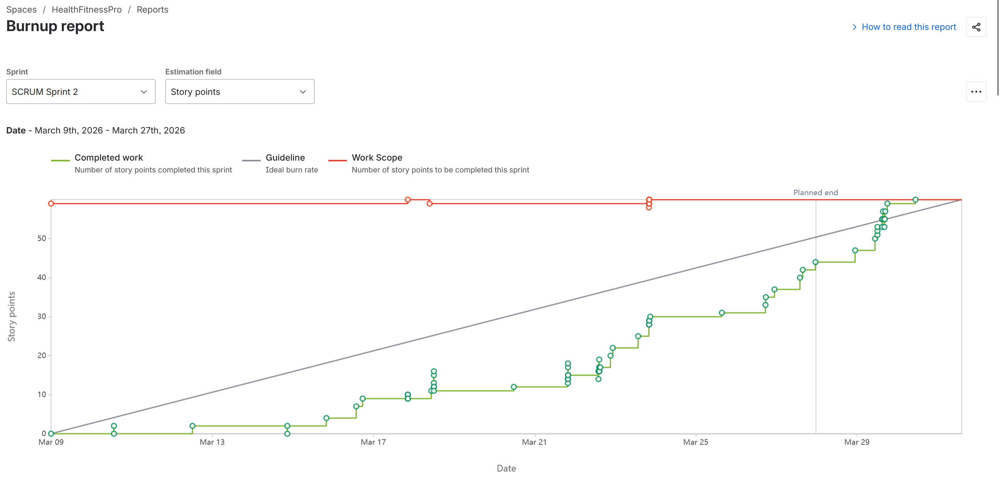

# HealthFitnessPro

## Table of Contents

- [General Info](#general-information)
- [Technologies Used](#technologies-used)
- [Features](#features)
- [Screenshots](#screenshots)
- [Setup](#setup)
- [Usage](#usage)
- [Project Status](#project-status)
- [Room for Improvement](#room-for-improvement)
- [Acknowledgements](#acknowledgements)
- [Contact](#contact)

<!-- * [License](#license) -->

## General Information

- The project consists of Diego Dominguez-Albiter, Saroj Gautam, Connor Lopez, Abhinesh Dahal, and Angel Verde-Salas.
- We are creating a Fitness App. This will have precreated workouts, a workout history, and a list of exercises.
- We are creating this application to improve the fitness knowledge of the general public.
- We undertook this project as we found fitness to be very closely correlated to health which has great importance. This app will hopefully lead people to have a more positive relationship with working out which will help their health.
  <!-- You don't have to answer all the questions - just the ones relevant to your project. -->

  

## Technologies Used

- FastAPI
- ASCENDAPI
- Languages - Javascript, Python, CSS, HTML

## Sprint 1

### Contributions

---

#### Diego — Frontend UI, Wireframes & Unit Tests

> Designed the initial frontend and UI visualization through wireframes. Created the frontend for two user stories and wrote unit tests for multiple features.

- **SCRUM-50:** Design - Frontend UI Layout (Front Page) — [Jira](https://cs3398-zabraks-s26.atlassian.net/browse/SCRUM-50) | [PR #1](https://bitbucket.org/cs3398-zabraks-s26/main_application/pull-requests/1)
- **SCRUM-10:** Design - UI Flow (Exercise Templates) — [Jira](https://cs3398-zabraks-s26.atlassian.net/browse/SCRUM-10) | [PR #2](https://bitbucket.org/cs3398-zabraks-s26/main_application/pull-requests/2)
- **SCRUM-54:** Unit Testing - Front Page — [Jira](https://cs3398-zabraks-s26.atlassian.net/browse/SCRUM-54) | [PR #18](https://bitbucket.org/cs3398-zabraks-s26/main_application/pull-requests/18)
- **SCRUM-33:** UI/Frontend - Workout History — [Jira](https://cs3398-zabraks-s26.atlassian.net/browse/SCRUM-33) | [PR #22](https://bitbucket.org/cs3398-zabraks-s26/main_application/pull-requests/22)
- **SCRUM-25:** UI/Frontend - Custom Workout — [Jira](https://cs3398-zabraks-s26.atlassian.net/browse/SCRUM-25) | [PR #24](https://bitbucket.org/cs3398-zabraks-s26/main_application/pull-requests/24)
- **SCRUM-27:** Unit Testing - Custom Workout — [Jira](https://cs3398-zabraks-s26.atlassian.net/browse/SCRUM-27) | [PR #33](https://bitbucket.org/cs3398-zabraks-s26/main_application/pull-requests/33)
- **SCRUM-6:** Unit Testing - Exercise Library — [Jira](https://cs3398-zabraks-s26.atlassian.net/browse/SCRUM-6) | [PR #32](https://bitbucket.org/cs3398-zabraks-s26/main_application/pull-requests/32)

---

#### Abhinesh — Backend API Client, Exercise Templates & Integration

> Built the backend exercise API client and connected the frontend to the FastAPI backend. Implemented exercise templates on both backend and frontend, and wrote unit tests for template endpoints.

- **SCRUM-53:** Integration - Exercise Data Loading (ExRx API via FastAPI) — [Jira](https://cs3398-zabraks-s26.atlassian.net/browse/SCRUM-53) | [PR #7](https://bitbucket.org/cs3398-zabraks-s26/main_application/pull-requests/7)
- **SCRUM-52:** Implementation - Connect Navigation to Backend (FastAPI) — [Jira](https://cs3398-zabraks-s26.atlassian.net/browse/SCRUM-52) | [PR #21](https://bitbucket.org/cs3398-zabraks-s26/main_application/pull-requests/21)
- **SCRUM-9:** Implementation - Backend (Exercise Templates) — [Jira](https://cs3398-zabraks-s26.atlassian.net/browse/SCRUM-9) | [PR #21](https://bitbucket.org/cs3398-zabraks-s26/main_application/pull-requests/21)
- **SCRUM-11:** Implementation - Frontend (Exercise Templates) — [Jira](https://cs3398-zabraks-s26.atlassian.net/browse/SCRUM-11) | [PR #25](https://bitbucket.org/cs3398-zabraks-s26/main_application/pull-requests/25)
- **SCRUM-12:** Unit Testing - Templates — [Jira](https://cs3398-zabraks-s26.atlassian.net/browse/SCRUM-12) | [PR #26](https://bitbucket.org/cs3398-zabraks-s26/main_application/pull-requests/26)

---

#### Angel — Database Schemas, Data Models & Custom Workout Creator

> Designed database schema for exercise templates, data model and API for the exercise library, and the schema for the custom workout creator. Implemented the custom workout creator and built the UI for the calendar view.

- **SCRUM-35:** Calendar View - Workout History — [Jira](https://cs3398-zabraks-s26.atlassian.net/browse/SCRUM-35) | [PR #19](https://bitbucket.org/cs3398-zabraks-s26/main_application/pull-requests/19)
- **SCRUM-8:** Design - Database Schema (Exercise Templates) — [Jira](https://cs3398-zabraks-s26.atlassian.net/browse/SCRUM-8) | [PR #3](https://bitbucket.org/cs3398-zabraks-s26/main_application/pull-requests/3)
- **SCRUM-2:** Design - API & Data Model (Exercise Library) — [Jira](https://cs3398-zabraks-s26.atlassian.net/browse/SCRUM-2) | [PR #10](https://bitbucket.org/cs3398-zabraks-s26/main_application/pull-requests/10)
- **SCRUM-22:** Design - Schema (Custom Workout Creator) — [Jira](https://cs3398-zabraks-s26.atlassian.net/browse/SCRUM-22) | [PR #14](https://bitbucket.org/cs3398-zabraks-s26/main_application/pull-requests/14)
- **SCRUM-26:** Implementation - Custom Workout Creator — [Jira](https://cs3398-zabraks-s26.atlassian.net/browse/SCRUM-26) | [PR #28](https://bitbucket.org/cs3398-zabraks-s26/main_application/pull-requests/28)

---

#### Connor — Backend for Workout History, Custom Workouts & Progress Tracking

> Designed the UI wireframe for the workout library. Created the backend for workout history, custom workout creator, and progress tracker. Built the workout logging API and integrated it into the frontend.

- **SCRUM-7:** Design - UI Wireframe (Exercise Library) — [Jira](https://cs3398-zabraks-s26.atlassian.net/browse/SCRUM-7) | [PR #4](https://bitbucket.org/cs3398-zabraks-s26/main_application/pull-requests/4)
- **SCRUM-31:** Backend - Workout History — [Jira](https://cs3398-zabraks-s26.atlassian.net/browse/SCRUM-31) | [PR #15](https://bitbucket.org/cs3398-zabraks-s26/main_application/pull-requests/15)
- **SCRUM-24:** Backend - Custom Workout Creator — [Jira](https://cs3398-zabraks-s26.atlassian.net/browse/SCRUM-24) | [PR #16](https://bitbucket.org/cs3398-zabraks-s26/main_application/pull-requests/16)
- **SCRUM-32:** Workout Logging API - Workout History — [Jira](https://cs3398-zabraks-s26.atlassian.net/browse/SCRUM-32) | [PR #23](https://bitbucket.org/cs3398-zabraks-s26/main_application/pull-requests/23)
- **SCRUM-36:** Progress Tracking - Workout History — [Jira](https://cs3398-zabraks-s26.atlassian.net/browse/SCRUM-36) | [PR #27](https://bitbucket.org/cs3398-zabraks-s26/main_application/pull-requests/27)

---

#### Saroj

> Developed the homepage, implemented the workout library frontend, and integrated it with the backend to ensure seamless functionality and data flow.

- **SCRUM-51:** Implementation – Build Home Screen(Home Screen) - [Jira](https://cs3398-zabraks-s26.atlassian.net/browse/SCRUM-51) | [PR #13](https://bitbucket.org/cs3398-zabraks-s26/main_application/pull-requests/13)
- **SCRUM-4:** Implementation – Frontend: Workout Library(Workout Library) - [Jira](https://cs3398-zabraks-s26.atlassian.net/browse/SCRUM-4) | [PR #29](https://bitbucket.org/cs3398-zabraks-s26/main_application/pull-requests/29)
- **SCRUM-5:** Implementation – Backend Integration: Workout Library - [Jira](https://cs3398-zabraks-s26.atlassian.net/browse/SCRUM-4) | [PR #30](https://bitbucket.org/cs3398-zabraks-s26/main_application/pull-requests/30)

---

### Burnup Chart



## Sprint 2

### Contributions

---

#### Diego — React Refactoring, Unit Testing, File Clean Up

> Led the charge when refactoring/migrating legacy HTML code into React. Added all the logic from the frontend which connected it to the backend after the refactor. Integrated an API for the Calorie Tracker which was used to find the different foods used for it. Updated legacy unit tests for the frontend. Added unit tests for the new features added. Also cleaned up the React files so that they were sufficiently and cleanly following SRP. This is through taking out hook logic from pages and making sure the UI is in components.

- **SCRUM-70:** Migrate Dashboard HTML layout to React component structure [Jira](https://cs3398-zabraks-s26.atlassian.net/browse/SCRUM-70) | [PR](https://bitbucket.org/cs3398-zabraks-s26/main_application/pull-requests/39)
- **SCRUM-72:** Migrate Library to React [Jira](https://cs3398-zabraks-s26.atlassian.net/browse/SCRUM-72) | [PR](https://bitbucket.org/cs3398-zabraks-s26/main_application/pull-requests/47)
- **SCRUM-73:** Migrate History to React [Jira](https://cs3398-zabraks-s26.atlassian.net/browse/SCRUM-73) | [PR](https://bitbucket.org/cs3398-zabraks-s26/main_application/pull-requests/46)
- **SCRUM-74:** Unit Testing Reach Functionality [Jira](https://cs3398-zabraks-s26.atlassian.net/browse/SCRUM-74) | [PR](https://bitbucket.org/cs3398-zabraks-s26/main_application/pull-requests/56)
- **SCRUM-67:** Backend Logic Consolidation + Connection to Frontend [Jira](https://cs3398-zabraks-s26.atlassian.net/browse/SCRUM-67) | [PR](https://bitbucket.org/cs3398-zabraks-s26/main_application/pull-requests/54)
- **SCRUM-43:** API Integration [Jira](https://cs3398-zabraks-s26.atlassian.net/browse/SCRUM-43) | [PR](https://bitbucket.org/cs3398-zabraks-s26/main_application/pull-requests/61)
- **SCRUM-30:** Unit Testing - Timer [Jira](https://cs3398-zabraks-s26.atlassian.net/browse/SCRUM-30) | [PR](https://bitbucket.org/cs3398-zabraks-s26/main_application/pull-requests/66)
- **SCRUM-49:** Unit Testing - Calorie Tracker [Jira](https://cs3398-zabraks-s26.atlassian.net/browse/SCRUM-49) | [PR](https://bitbucket.org/cs3398-zabraks-s26/main_application/pull-requests/67)
- **SCRUM-59:** Unit Testing - Security [Jira](https://cs3398-zabraks-s26.atlassian.net/browse/SCRUM-59) | [PR](https://bitbucket.org/cs3398-zabraks-s26/main_application/pull-requests/68)
- **SCRUM-85:** Cleaning Up Frontend Functions//SOLID Principles [Jira](https://cs3398-zabraks-s26.atlassian.net/browse/SCRUM-85) | [PR](https://bitbucket.org/cs3398-zabraks-s26/main_application/pull-requests/64)
- **SCRUM-86:** Hook Unit Tests [Jira](https://cs3398-zabraks-s26.atlassian.net/browse/SCRUM-86) | [PR](https://bitbucket.org/cs3398-zabraks-s26/main_application/pull-requests/69)

---

#### Abhinesh — Backend Refactor, Rest Timer & Settings

> Executed a full backend architectural overhaul, restructuring into a layered app factory with dedicated API routes, service, and CRUD layers, and migrating from SQLite to Supabase PostgreSQL with Alembic migrations. Built and integrated the rest timer into the active workout flow, including a Settings page for persistent default rest durations. Also implemented the Workout In Progress page with live exercise image loading.

- **SCRUM-80:** Backend Architecture Refactor (FastAPI + SQLModel + PostgreSQL) — [Jira](https://cs3398-zabraks-s26.atlassian.net/browse/SCRUM-80) | [PR #41](https://bitbucket.org/cs3398-zabraks-s26/main_application/pull-requests/41)
- **SCRUM-66:** API Endpoints Consolidation — [Jira](https://cs3398-zabraks-s26.atlassian.net/browse/SCRUM-66) | [PR #49](https://bitbucket.org/cs3398-zabraks-s26/main_application/pull-requests/49)
- **SCRUM-68:** Backend Code Documentation — [Jira](https://cs3398-zabraks-s26.atlassian.net/browse/SCRUM-68) | [PR #45](https://bitbucket.org/cs3398-zabraks-s26/main_application/pull-requests/45)
- **SCRUM-65:** Backend Architecture Documentation — [Jira](https://cs3398-zabraks-s26.atlassian.net/browse/SCRUM-65) | [PR #37](https://bitbucket.org/cs3398-zabraks-s26/main_application/pull-requests/37)
- **SCRUM-14:** Implementation - Workout In Progress Page & Exercise Image Loading — [Jira](https://cs3398-zabraks-s26.atlassian.net/browse/SCRUM-14)
- **SCRUM-23:** Implementation - RestTimer React Component — [Jira](https://cs3398-zabraks-s26.atlassian.net/browse/SCRUM-23) | [PR #55](https://bitbucket.org/cs3398-zabraks-s26/main_application/pull-requests/55)
- **SCRUM-28:** Feature - RestTimer Full Implementation (countdown, presets, ring UI) — [Jira](https://cs3398-zabraks-s26.atlassian.net/browse/SCRUM-28) | [PR #58](https://bitbucket.org/cs3398-zabraks-s26/main_application/pull-requests/58)
- **SCRUM-29:** Settings Page & Persistent Rest Duration — [Jira](https://cs3398-zabraks-s26.atlassian.net/browse/SCRUM-29) | [PR #59](https://bitbucket.org/cs3398-zabraks-s26/main_application/pull-requests/59)

---

#### Angel —

> Designed UI of Nutrition, Account, Front page, Workout history and Timer. Implemented frontend of Workout templates and account.

- **SCRUM-57:** implementation – frontend authentication UI| [Jira](https://cs3398-zabraks-s26.atlassian.net/browse/SCRUM-57) | [PR #53](https://bitbucket.org/cs3398-zabraks-s26/main_application/pull-requests/63)
- **SCRUM-46:** implement frontend calorie tracker| [Jira](https://bitbucket.org/cs3398-zabraks-s26/main_application/pull-requests/62) | [PR #62](https://bitbucket.org/cs3398-zabraks-s26/main_application/pull-requests/62)
- **SCRUM-45:** design nutrition page | [Jira](https://cs3398-zabraks-s26.atlassian.net/browse/SCRUM-45) | [PR #52](https://bitbucket.org/cs3398-zabraks-s26/main_application/pull-requests/52)
- **SCRUM-21:** design ui timer |[Jira](https://cs3398-zabraks-s26.atlassian.net/browse/SCRUM-21) | [PR #48](https://bitbucket.org/cs3398-zabraks-s26/main_application/pull-requests/48)
- **SCRUM-71:** migrate workout templates feature | [Jira](https://cs3398-zabraks-s26.atlassian.net/browse/SCRUM-71) | [PR #40](https://bitbucket.org/cs3398-zabraks-s26/main_application/pull-requests/40)
- **SCRUM-69:** offical documentation for the frontend | [Jira](https://cs3398-zabraks-s26.atlassian.net/browse/SCRUM-69) | [PR #38](https://bitbucket.org/cs3398-zabraks-s26/main_application/pull-requests/38)

---

#### Connor — Backend for User Authentication, Protection of Routes, and Implementation of Reset Function

- **SCRUM-55:** Design - User Authentication Mmodel (FastAPI) - [Jira](https://cs3398-zabraks-s26.atlassian.net/browse/SCRUM-55) | [PR #51](https://bitbucket.org/cs3398-zabraks-s26/main_application/pull-requests/51)
- **SCRUM-56:** Implementation - Backend Authentication (FastAPI) - [Jira](https://cs3398-zabraks-s26.atlassian.net/browse/SCRUM-56) | [PR #53](https://bitbucket.org/cs3398-zabraks-s26/main_application/pull-requests/53)
- **SCRUM-58:** Secure API Protection (FastAPI) - [Jira](https://cs3398-zabraks-s26.atlassian.net/browse/SCRUM-58) | [PR #60](https://bitbucket.org/cs3398-zabraks-s26/main_application/pull-requests/60)
- **SCRUM-48:** Logic - History - Nutrition & Calorie Tracker - [Jira](https://cs3398-zabraks-s26.atlassian.net/browse/SCRUM-48) | [Pr #65](https://bitbucket.org/cs3398-zabraks-s26/main_application/pull-requests/65)

---

#### Saroj —

- **SCRUM-76:** Containerization & Build Optimization - [Jira](https://cs3398-zabraks-s26.atlassian.net/browse/SCRUM-76) | [PR #57](https://bitbucket.org/cs3398-zabraks-s26/main_application/pull-requests/57)
- **SCRUM-75:** Environment Configuration & Secret Management - [Jira](https://cs3398-zabraks-s26.atlassian.net/browse/SCRUM-75) | [PR #70](https://bitbucket.org/cs3398-zabraks-s26/main_application/pull-requests/70)
- **SCRUM-79:** SSL/TLS and Domain Mapping - [Jira](https://cs3398-zabraks-s26.atlassian.net/browse/SCRUM-79) | [PR #75](https://bitbucket.org/cs3398-zabraks-s26/main_application/pull-requests/75)
- **SCRUM-77:** Infrastructure Provisioning & Web Server Setup - [Jira](https://cs3398-zabraks-s26.atlassian.net/browse/SCRUM-77) | [PR #72](https://bitbucket.org/cs3398-zabraks-s26/main_application/pull-requests/72)
- **SCRUM-78:** Post-Deployment Smoke Testing - [Jira](https://cs3398-zabraks-s26.atlassian.net/browse/SCRUM-78) | [PR #77](https://bitbucket.org/cs3398-zabraks-s26/main_application/pull-requests/77)

---

### Next Steps

If we were going to continue this project for the next Sprint our next steps would be  `<br>`

- Reviewing our current exercise API and possibly swapping it out for a new one. We had a couple of issues with the API we are currently using and the information it provides us. `<br>`
- Reviewing some bugs which were found in the application during our demo by peers. This includes the Calorie Tracker storage not working when not signed in and when trying to zero the daily calories it resetting to 2000. `<br>`
- Populating our current application with more data as it currently has a small amount of it. This means adding more exercise templates. This is tied into a new exercise API. `<br>`
- Adding more information to view in the Calorie Tracker such as protein or sugars instead of just calories. `<br>`

---

### Burnup Chart



---

## Sprint 3

### Contributions

---

#### Diego — Upgrading Nutrition Tracker, Reuseability in Frontend Components

> Upgraded the nutrition tracker so that instead of just tracking calories it now tracks calories,fats,proteins,carbs. Many components in the Frontend had similar code so I created common components to be used across the frontend for simplicity and flexibility in the future.

- **SCRUM-97** Reading more data from API in backend [Jira](https://cs3398-zabraks-s26.atlassian.net/browse/SCRUM-97) | [PR](https://bitbucket.org/cs3398-zabraks-s26/main_application/pull-requests/78)
- **SCRUM-98** Writing more data in frontend from backend [Jira](https://cs3398-zabraks-s26.atlassian.net/browse/SCRUM-98) | [PR](https://bitbucket.org/cs3398-zabraks-s26/main_application/pull-requests/80)
- **SCRUM-99** Performance metrics for nutritions [Jira](https://cs3398-zabraks-s26.atlassian.net/browse/SCRUM-99) | [PR](https://bitbucket.org/cs3398-zabraks-s26/main_application/pull-requests/82)
- **SCRUM-111** Document Similar Components across Pages and Create Tasks for Common Components [Jira](https://cs3398-zabraks-s26.atlassian.net/browse/SCRUM-111) | [PR](https://bitbucket.org/cs3398-zabraks-s26/main_application/pull-requests/89)
- **SCRUM-108** Create common Hero Component across the pages [Jira](https://cs3398-zabraks-s26.atlassian.net/browse/108) | [PR](https://bitbucket.org/cs3398-zabraks-s26/main_application/pull-requests/94)
- **SCRUM-113** Category / Filter Button Bars Common Component [Jira](https://cs3398-zabraks-s26.atlassian.net/browse/113) | [PR](https://bitbucket.org/cs3398-zabraks-s26/main_application/pull-requests/95)
- **SCRUM-114** Numeric Stepper Common Component [Jira](https://cs3398-zabraks-s26.atlassian.net/browse/114) | [PR](https://bitbucket.org/cs3398-zabraks-s26/main_application/pull-requests/96)
- **SCRUM-115** Exercise / Workout Cards Common Component [Jira](https://cs3398-zabraks-s26.atlassian.net/browse/115) | [PR](https://bitbucket.org/cs3398-zabraks-s26/main_application/pull-requests/100)
- **SCRUM-116** Modal / Overlay Pattern Common Component [Jira](https://cs3398-zabraks-s26.atlassian.net/browse/116) | [PR](https://bitbucket.org/cs3398-zabraks-s26/main_application/pull-requests/101)
- **SCRUM-117** Trend Chart Section Common Component [Jira](https://cs3398-zabraks-s26.atlassian.net/browse/117) | [PR](https://bitbucket.org/cs3398-zabraks-s26/main_application/pull-requests/102)
- **SCRUM-118** Exercise Muscle/Equipment Badge Pair Commonality [Jira](https://cs3398-zabraks-s26.atlassian.net/browse/118) | [PR](https://bitbucket.org/cs3398-zabraks-s26/main_application/pull-requests/103)
- **SCRUM-119** Auth Form Text Field Common Component [Jira](https://cs3398-zabraks-s26.atlassian.net/browse/119) | [PR](https://bitbucket.org/cs3398-zabraks-s26/main_application/pull-requests/104)
- **SCRUM-120** Account Section Wrapper [Jira](https://cs3398-zabraks-s26.atlassian.net/browse/120) | [PR](https://bitbucket.org/cs3398-zabraks-s26/main_application/pull-requests/105)
- **SCRUM-121** Async State Display Common Component [Jira](https://cs3398-zabraks-s26.atlassian.net/browse/121) | [PR](https://bitbucket.org/cs3398-zabraks-s26/main_application/pull-requests/106)
- **SCRUM-133** Frontend - Unit Test Execution and Results [Jira](https://cs3398-zabraks-s26.atlassian.net/browse/133) | [PR](https://bitbucket.org/cs3398-zabraks-s26/main_application/pull-requests/109)

---

#### Abhinesh — Upgraded Exercise API, Exercise Templates & Testing

> Migrated the exercise API to a new provider, normalizing data schemas and updating all related backend endpoints and tests. Designed and executed the frontend unit testing plan for the exercise templates feature, and shipped final bug fixes.

- **SCRUM-92** Find New Exercise API and update Credentials [Jira](https://cs3398-zabraks-s26.atlassian.net/browse/SCRUM-92) | [PR #81](https://bitbucket.org/cs3398-zabraks-s26/main_application/pull-requests/81)
- **SCRUM-95** Updating Schema of New API usage [Jira](https://cs3398-zabraks-s26.atlassian.net/browse/SCRUM-95) | [PR #88](https://bitbucket.org/cs3398-zabraks-s26/main_application/pull-requests/88)
- **SCRUM-93** Normalization of new data from New API [Jira](https://cs3398-zabraks-s26.atlassian.net/browse/SCRUM-93) | [PR #93](https://bitbucket.org/cs3398-zabraks-s26/main_application/pull-requests/93)
- **SCRUM-94** Updating API endpoints [Jira](https://cs3398-zabraks-s26.atlassian.net/browse/SCRUM-94) | [PR #92](https://bitbucket.org/cs3398-zabraks-s26/main_application/pull-requests/92)
- **SCRUM-96** Updating tests that deal with new API [Jira](https://cs3398-zabraks-s26.atlassian.net/browse/SCRUM-96) | [PR #118](https://bitbucket.org/cs3398-zabraks-s26/main_application/pull-requests/118)
- **SCRUM-128** Exercise Template — Testing plan [Jira](https://cs3398-zabraks-s26.atlassian.net/browse/SCRUM-128) | [PR #126](https://bitbucket.org/cs3398-zabraks-s26/main_application/pull-requests/126)
- **SCRUM-132** Exercise Template — Test Execution and Results [Jira](https://cs3398-zabraks-s26.atlassian.net/browse/SCRUM-132) | [PR #130](https://bitbucket.org/cs3398-zabraks-s26/main_application/pull-requests/130)
- **SCRUM-137** Final fixes [Jira](https://cs3398-zabraks-s26.atlassian.net/browse/SCRUM-137) | [PR #133](https://bitbucket.org/cs3398-zabraks-s26/main_application/pull-requests/133)

---

#### Angel — Database Schemas, Data Models & Custom Workout Creator
> Developed and documented shared frontend architecture by analyzing component overlap, defining reusable patterns, and implementing frontend common components to improve consistency and maintainability.

- **SCRUM-110:** Implement the links in the footer — [Jira](https://cs3398-zabraks-s26.atlassian.net/browse/SCRUM-110) | [PR #79](https://bitbucket.org/cs3398-zabraks-s26/main_application/pull-requests/79)
- **SCRUM-112:** Implement about and contact pages — [Jira](https://cs3398-zabraks-s26.atlassian.net/browse/SCRUM-112) | [PR #87](https://bitbucket.org/%7B1a7d2622-da3b-427b-94cf-594f66bc4a35%7D/%7B7374849d-2806-49f4-8457-a47dca12d17c%7D/pull-requests/87)
- **SCRUM-91:** Document signed in/signed out bugs — [Jira](https://cs3398-zabraks-s26.atlassian.net/browse/SCRUM-91) | [PR #90](https://bitbucket.org/%7B1a7d2622-da3b-427b-94cf-594f66bc4a35%7D/%7B7374849d-2806-49f4-8457-a47dca12d17c%7D/pull-requests/90)
- **SCRUM-122:** Fix front page and authentication bugs — [Jira](https://cs3398-zabraks-s26.atlassian.net/browse/SCRUM-122) | [PR #97](https://bitbucket.org/%7B1a7d2622-da3b-427b-94cf-594f66bc4a35%7D/%7B7374849d-2806-49f4-8457-a47dca12d17c%7D/pull-requests/97)
- **SCRUM-123:** Fix workout template bugs — [Jira](https://cs3398-zabraks-s26.atlassian.net/browse/SCRUM-123) | [PR #114](https://bitbucket.org/%7B1a7d2622-da3b-427b-94cf-594f66bc4a35%7D/%7B7374849d-2806-49f4-8457-a47dca12d17c%7D/pull-requests/114)
- **SCRUM-109:** Create a dark/light mode component — [Jira](https://cs3398-zabraks-s26.atlassian.net/browse/SCRUM-109) | [PR #115](https://bitbucket.org/%7B1a7d2622-da3b-427b-94cf-594f66bc4a35%7D/%7B7374849d-2806-49f4-8457-a47dca12d17c%7D/pull-requests/115)
- **SCRUM-127:** Custom template testing plan — [Jira](https://cs3398-zabraks-s26.atlassian.net/browse/SCRUM-127) | [PR #122](https://bitbucket.org/%7B1a7d2622-da3b-427b-94cf-594f66bc4a35%7D/%7B7374849d-2806-49f4-8457-a47dca12d17c%7D/pull-requests/122)
- **SCRUM-131:** Added report, test files, and results for custom unit test — [Jira](https://cs3398-zabraks-s26.atlassian.net/browse/SCRUM-131) | [PR #124](https://bitbucket.org/%7B1a7d2622-da3b-427b-94cf-594f66bc4a35%7D/%7B7374849d-2806-49f4-8457-a47dca12d17c%7D/pull-requests/124)

---

#### Connor — Refactored API Endpoints by adding summaries, authentication and removing unnecessary code

- **SCRUM-100** Clean up the definitions/wordings of each endpoint [Jira](https://cs3398-zabraks-s26.atlassian.net/browse/SCRUM-100) | [PR #83](https://bitbucket.org/cs3398-zabraks-s26/main_application/pull-requests/83)
- **SCRUM-101** Add authentication of data to endpoints [Jira](https://cs3398-zabraks-s26.atlassian.net/browse/SCRUM-101) | [PR #107](https://bitbucket.org/cs3398-zabraks-s26/main_application/pull-requests/107)
- **SCRUM-102** Review frontend for security flaws or logic which should not be there [Jira](https://cs3398-zabraks-s26.atlassian.net/browse/SCRUM-102) | [PR #117](https://bitbucket.org/cs3398-zabraks-s26/main_application/pull-requests/117)
- **SCRUM-129** Calorie Tracker Backend - Test Execution and Results [Jira](https://cs3398-zabraks-s26.atlassian.net/browse/SCRUM-129) | [PR #121](https://bitbucket.org/cs3398-zabraks-s26/main_application/pull-requests/121)
- **SCRUM-125** Calorie Tracker Backend - Testing plan [Jira](https://cs3398-zabraks-s26.atlassian.net/browse/SCRUM-125) | [PR #120](https://bitbucket.org/cs3398-zabraks-s26/main_application/pull-requests/120)

---

#### Saroj

---

### Next Steps

- Our next steps will be largely towards breaking down our services into microservices. We have done steps towards this and we just need to come together as a team and do that final push.
- We will work towards improving our use of the database and how we communicate with that as we have had multiple issues with that.

## Features

User Stories:

1. As a health enthusiast I would like a library of exercises so that I can know what muscles to target per exercise.
2. As a gym enthusiast I would like some exercise templates so that I can thoroughly and consistently exercise every week.
3. As a gym enthusiast, I want to create my own custom workout routines from the exercise library so that I can follow a personalized plan that fits my specific goals.
4. As a dedicated athlete, I want to log my actual sets, reps, and weight during a workout so that I can see my progress over time.
5. As a health-conscious user, I want to log my daily food intake so that I can monitor my calorie balance against my activity levels.
6. As a runner, I want to track my distance, time, and route via GPS so that I can see a map of my run and analyze my pace.
7. As a disciplined lifter, I want a dedicated rest timer and clock within the app, so that I don't have to switch to my phone's clock app between sets.
8. As a mobile-first athlete, I want to access my workout library, track my runs via GPS, and receive haptic notifications, so that I can train anywhere—from the gym floor to outdoor trails—without needing a laptop.
9. As a customer, I would like a nice and easily interpretable front page so I can navigate and use the application.
10. As a customer, I would like to have a secure account to protect sensitive information so I can use my account across platforms.

## Screenshots

<!-- Add screenshots here as they become available -->

## Setup

### Prerequisites

- Python 3.10+
- Node.js (for running frontend tests)
- A [RapidAPI](https://rapidapi.com/) key for the ExerciseDB API

### Dependencies

- **Backend (Python):** Listed in `requirements.txt` — includes FastAPI, Uvicorn, SQLAlchemy, httpx, python-dotenv, and Pydantic.
- **Frontend tests (Node):** Listed in `package.json` — includes Jest and Babel for unit testing.

### Installation

1. **Clone the repository**

   ```bash
   git clone <repository-url>
   cd main_application
   ```
2. **Create a Python virtual environment and install dependencies**

   ```bash
   python -m venv venv
   source venv/bin/activate   # On Windows: venv\Scripts\activate
   pip install -r requirements.txt
   ```
3. **Set up environment variables**

   Create a `.env` file in the project root with your RapidAPI key:

   ```
   XRAPID_API_KEY=your_rapidapi_key_here
   ```
4. **Install Node dependencies** (only needed for running frontend tests)

   ```bash
   npm install
   ```

### Running the Application

1. **Start the backend server**

   ```bash
   uvicorn app.backend.main:app --reload
   ```

   The API will be available at `http://127.0.0.1:8000` and the interactive docs at `http://127.0.0.1:8000/docs`.
2. **Open the frontend**

   Open `app/frontend/front_page/index.html` in your browser, or serve the `app/frontend/` directory with any static file server.

### Running Tests

```bash
npm test
```

## Usage

Once the backend server is running, the app provides the following features:

**Exercise Library** — Browse a catalog of exercises pulled from the ExerciseDB API. Each exercise includes target muscles and detailed information.

**Exercise Templates** — View pre-built workout templates or create your own. Templates group exercises together into a structured routine.

**Custom Workout Creator** — Build personalized workouts by selecting exercises from the library and organizing them into your own routine.

**Workout History** — Log your completed workouts with sets, reps, and weight. View past sessions through the calendar view to track consistency.

**Progress Tracker** — Monitor your performance over time to see how your lifts and activity are improving.

**API Docs** — Visit `http://127.0.0.1:8000/docs` to explore and test all backend endpoints interactively.

## Project Status

Project is currently: **In Progress** 🔧

## Room for Improvement

### To do:

- Library of Exercises
  - The library of exercises will be a huge catalog of different exercises a person can do and can find in depth information. This will help users who are not familar with different exercises so that they can learn a variety of them.
- Workout Templates
  - This will be prebuilt workouts with different exercises within them. This will be the main appeal of the application. This will be used for people who are not sure which exercises pair up together or who just want to boot up a workout without thinking of what to do beforehand.
- History of Workouts
  - This will be a place in which a person may catalog the workouts which they have done previously. This is helpful for a user so that they know what they have done previously and what they must do in the future.

## Acknowledgements

- [ExerciseDB API](https://rapidapi.com/) for providing exercise data
- [FastAPI](https://fastapi.tiangolo.com/) for the backend framework
