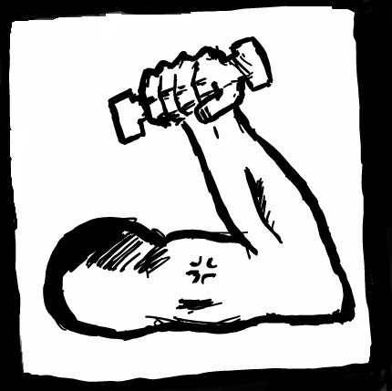

# HealthFitnessPro
> Our application is simple place in which a person can catalog their workouts and learn many new ones as well.
> Live demo [_here_](https://www.example.com). <!-- If you have the project hosted somewhere, include the link here. -->

## Table of Contents
* [General Info](#general-information)
* [Technologies Used](#technologies-used)
* [Features](#features)
* [Screenshots](#screenshots)
* [Setup](#setup)
* [Usage](#usage)
* [Project Status](#project-status)
* [Room for Improvement](#room-for-improvement)
* [Acknowledgements](#acknowledgements)
* [Contact](#contact)
<!-- * [License](#license) -->

## General Information
- The project consists of Diego Dominguez-Albiter, Saroj Gautam, Connor Lopez, Abhinesh Dahal, and Angel Verde-Salas.
- We are creating a Fitness App. This will have precreated workouts, a workout history, and a list of exercises.
- We are creating this application to improve the fitness knowledge of the general public.
- We undertook this project as we found fitness to be very closely correlated to health which has great importance. This app will hopefully lead people to have a more positive relationship with working out which will help their health.
<!-- You don't have to answer all the questions - just the ones relevant to your project. -->

## Technologies Used
- React Native
- FastAPI
- ExRx.net Exercise JSON Rest API 

## Features
User Stories:

1.  As a health enthusiast I would like a library of exercises so that I can know what muscles to target per exercise. 

1.  As a gym enthusiast I would like some exercise templates so that I can thoroughly and consistently exercise every week. 

1.  As a gym enthusiast, I want to create my own custom workout routines from the exercise library so that I can follow a personalized plan that fits my specific goals. 

1.  As a dedicated athlete, I want to log my actual sets, reps, and weight during a workout so that I can see my progress over time. 

1.  As a health-conscious user, I want to log my daily food intake so that I can monitor my calorie balance against my activity levels. 

1.  As a runner, I want to track my distance, time, and route via GPS so that I can see a map of my run and analyze my pace. 

1.  As a disciplined lifter, I want a dedicated rest timer and clock within the app, so that I don't have to switch to my phone's clock app between sets. 

1.  As a mobile-first athlete, I want to access my workout library, track my runs via GPS, and receive haptic notifications, so that I can train anywhere—from the gym floor to outdoor trails—without needing a laptop. 

1.  As a customer, I would like a nice and easily interpretable front page so I can navigate and use the application. 

1. As a customer, I would like to have a secure account to protect sensitive information so I can use my account across platforms. 
## Screenshots

<!-- If you have screenshots you'd like to share, include them here. -->

## Setup
What are the project requirements/dependencies? Where are they listed? A requirements.txt or a Pipfile.lock file perhaps? Where is it located?

Proceed to describe how to install / setup one's local environment / get started with the project.

## Usage
How does one go about using it?
Provide various use cases and code examples here.

`write-your-code-here`

## Project Status
Project is: _in progress_ / _complete_ / _no longer being worked on_. If you are no longer working on it, provide reasons why.

## Room for Improvement
Include areas you believe need improvement / could be improved. Also add TODOs for future development.

## Room for improvement:
- Improvement to be done 1
- Improvement to be done 2

## To do:
- Library of Exercises
    - The library of exercises will be a huge catalog of different exercises a person can do and can find in depth information. This will help users who are not familar with different exercises so that they can learn a variety of them.
- Workout Templates
    - This will be prebuilt workouts with different exercises within them. This will be the main appeal of the application. This will be used for people who are not sure which exercises pair up together or who just want to boot up a workout without thinking of what to do beforehand.
- History of Workouts 
    - This will be a place in which a person may catalog the workouts which they have done previously. This is helpful for a user so that they know what they have done previously and what they must do in the future.

## Acknowledgements
Give credit here.
- This project was inspired by...
- This project was based on [this tutorial](https://www.example.com).
- Many thanks to...

## Contact
Created by [@flynerdpl](https://www.flynerd.pl/) - feel free to contact me!

<!-- Optional -->
<!-- ## License -->
<!-- This project is open source and available under the [... License](). -->

<!-- You don't have to include all sections - just the one's relevant to your project -->